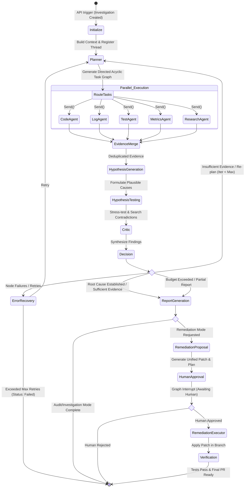

# Workflow Design — Autonomous Engineering Intelligence Platform

## 1. Graph State Machine Architecture

The workflow orchestrator is powered by LangGraph, implementing a durable, stateful, self-healing directed graph that coordinates specialized AI agents, tools, and human gates.

---

## 2. Dynamic Fan-Out (`Send` Protocol)

Instead of hard-coded execution paths, LangGraph's dynamic `Send` primitive is utilized:
1. The **Planner Agent** inspects the investigation objective and determines required sub-tasks.
2. The `route_tasks_node` inspects `state.planned_tasks` and dynamically produces `Send(node_name, state)` payloads for each pending task.
3. LangGraph executes the dispatched agent nodes asynchronously in parallel.
4. Each agent executes sandboxed tools via the **Tool Gateway**, attaching validated `EvidenceItem` records to the state.
5. All parallel branches automatically join into the `evidence_merge` node.

---

## 3. Evidence Lifecycle & Hypothesis Validation

Evidence and hypotheses progress through formal stages:

1. **Evidence Ingestion**: Tools return raw output (git diffs, logs, metrics, test outputs).
2. **Sanitization & Provenance**: Tool Gateway scrubs credentials, calculates hashes, and tags exact origin (commit hash, time range, log stream).
3. **Hypothesis Formation**:
   - `HypothesisAgent` links evidence items to hypotheses.
   - Initial confidence score is calculated deterministically based on supporting vs contradicting evidence counts and quality scores.
4. **Critic Falsification**:
   - `CriticAgent` explicitly seeks alternative hypotheses, checks for correlation vs causation fallacies, and flags missing telemetry.
   - Hypotheses that fail critique have their confidence downgraded or marked as `rejected`.

---

## 4. Human-In-The-Loop Interrupts

For safety and compliance:
- **Zero Automated Deployments**: The system never executes destructive changes or modifies production branches without human sign-off.
- **Graph Interrupts**: LangGraph `interrupt()` pauses execution before the `human_approval` node. State is serialized to PostgreSQL.
- **Resumption**: When an operator issues a POST to `/api/v1/approvals/{id}/approve`, the investigation state is restored, and the graph continues to `remediation_executor`.
